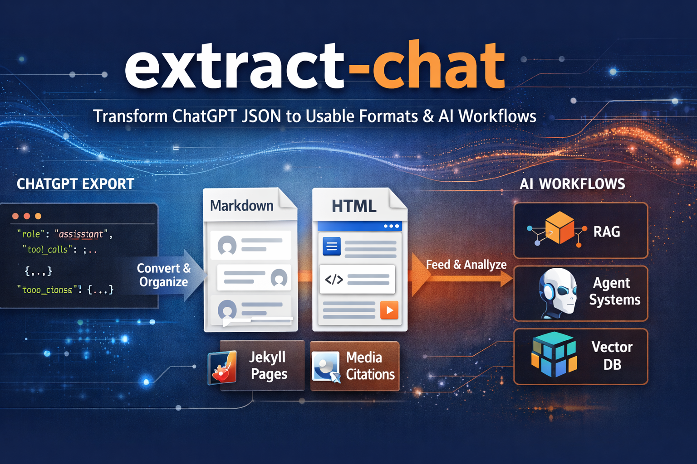

# extract-chat



[](#) [](LICENSE) [](#) [](#)

- [extract-chat](#extract-chat)
  - [Works with LogGPT](#works-with-loggpt)
  - [Where this fits (AI / ML workflows)](#where-this-fits-ai--ml-workflows)
  - [Typical Use Cases](#typical-use-cases)
  - [What It Produces](#what-it-produces)
  - [Installation](#installation)
  - [Quick Start](#quick-start)
  - [Documentation](#documentation)
  - [Python API](#python-api)
  - [Known Gaps](#known-gaps)
  - [Development](#development)
  - [Contributing](#contributing)
  - [Support This and Other Projects](#support-this-and-other-projects)
  - [Copyright](#copyright)
  - [Changelog](#changelog)
  - [License](#license)


`extract-chat` converts OpenAI and ChatGPT conversation JSON or LogGPT+ ZIP archives into readable Markdown or HTML conversation logs, with preserved citation links, local artifacts, schema diagnostics, and collapsible tool activity.

If you've ever downloaded your ChatGPT history and opened it thinking:

> “What am I supposed to do with this?”

This tool fixes that.

It converts raw exports into:

- 📄 readable Markdown (notes, archives, documentation)
- 🌐 clean HTML (browse or share)
- 🧱 structured content (Jekyll pages)
- 🧠 AI-ready data (for embeddings, RAG, and agents)

And it preserves things most tools lose:

- references and citations  
- tool calls and hidden assistant activity  
- system prompts and reusable context  

## Works with LogGPT

[`LogGPT`](https://github.com/unixwzrd/LogGPT) (also on the [Mac App Store](https://apps.apple.com/us/app/loggpt/id6743342693?mt=12)) downloads your ChatGPT conversations as JSON.

`extract-chat` is the next step.

**Typical workflow:**

1. Use LogGPT to download your conversation
2. Run `extract-chat` on the JSON or LogGPT+ ZIP
3. Get a clean, readable, portable transcript

With **LogGPT Plus**, you can also download all media (images, audio, files), and `extract-chat` will automatically link that media into the output. Version 0.7.0 adds support for generated files and uploaded attachments captured from ChatGPT Work conversations.

Together, they form a complete local archive + processing pipeline for ChatGPT data.

## Where this fits (AI / ML workflows)

This is not just a formatter—it’s a bridge between ChatGPT and real systems.

You can use `extract-chat` with:

- local RAG pipelines  
- vector databases  
- agent frameworks (OpenClaw, Hermes, custom agents)  
- research and forensic workflows  

It enables:

- conversation chunking for embeddings  
- replayable context for agents  
- structured memory ingestion  
- cross-session continuity  

Think of it as:

> **ChatGPT → structured data → usable intelligence**

## Typical Use Cases

- 📚 Archive ChatGPT conversations into readable documents  
- 🧠 Feed conversations into embeddings / vector databases  
- ✍️ Publish long-form content (Jekyll, blogs, docs)  
- 🔍 Preserve references, citations, and tool activity for analysis  
- 🔁 Reuse prior conversations for continuity  
- ⚖️ Maintain structured logs for research or forensic workflows  

## What It Produces

- A normal user/assistant conversation transcript.
- A separate `System Context` section when the export contains reusable profile or instruction context.
- A per-assistant-turn `Tools Used` collapsible section that gathers tool calls and hidden/internal assistant activity in timestamp order.
- A per-assistant-turn `References` collapsible section with forward and backward citation links.
- Optional Jekyll page export for long assistant turns and reference bundles.

## Installation

Requires Python 3.10+.

If you just want to use the tool, the easiest option is to install it directly from GitHub:

```bash
pip install "git+https://github.com/unixwzrd/extract-chat.git"
```

If you want a specific release:

```bash
pip install "git+https://github.com/unixwzrd/extract-chat.git@v0.7.5"
```

If you prefer to clone the repository first:

```bash
git clone https://github.com/unixwzrd/extract-chat.git
cd extract-chat
pip install .
```

For development, clone the repository and install in editable mode:

```bash
git clone https://github.com/unixwzrd/extract-chat.git
cd extract-chat
pip install -e .
```

After an editable install, run the test suite before opening a pull request or publishing changes:

```bash
pytest -q
```

Notes:

- Most people will use the command-line tool `extract-chat`.
- The Python package name is `extract_chat` if you do want to import it from code.
- The CLI entry point is `extract-chat`.
- HTML rendering uses the `markdown` package.
- Unicode normalization uses [`UnicodeFix`](https://github.com/unixwzrd/UnicodeFix), currently installed from GitHub.

## Quick Start

Markdown:

```bash
extract-chat path/to/conversation.json -o out.md
```

HTML:

```bash
extract-chat path/to/conversation.json --format html --output out.html
```

Complete archive extraction with UTC `start-date-end-date-title` names:

```bash
extract-chat conversation.zip \
  --format both \
  --emit-tsv \
  --chunk
```

Pass either a standalone conversation JSON file or a LogGPT+ ZIP as the positional input. Without `--output-dir`, a ZIP creates a sibling directory matching the conversation stem packaged inside it so exports sort with their source archives even if the ZIP was renamed. Generated transcript, chunk, and artifact-package names use the UTC start and update dates, for example `2026-08-15-2026-09-09-this-is-the-title-of-the-chat`. Use `--output-dir` to choose a different destination. Downloaded artifacts are copied to `<destination>/<generated-stem>/artifacts/`, and Markdown/HTML links prefer those local files. Existing CSV, TSV, and spreadsheet files remain ordinary original artifacts. Small parseable CSV/TSV artifacts may also be displayed as tables while the original download link is retained. `--emit-tsv` only derives a TSV from an embedded table when no matching downloaded table artifact is present.

Continuity chunks default to hybrid boundary selection with one turn of overlap. Every final Markdown part is measured after headers and overlap are added and may never exceed 524,288 UTF-8 bytes. Boundary strategy and overlap mode are independent; use `--chunk-strategy`, the byte/line/token limits, and at most one of the turn/line/byte overlap flags to select the behavior you need.

Every chunk directory includes `context-move-instructions.md`, generated from the actual bundle metadata. It records the chunk count, ordered filenames, boundary strategy, overlap mode, size ceiling, and upload batches so the transcript can be transferred into a fresh model context without editing a hand-written prompt. The upload plan defaults to 10 conversation chunks per batch and can be changed with `--chunk-upload-batch-size FILES`.

The native macOS front end lives in `macos/ExtractChatApp`; see
`macos/README.md` for development and helper-bundling details.

Jekyll bundle:

```bash
extract-chat path/to/conversation.json \
  --format jekyll \
  --jekyll-turn-id <assistant-turn-id> \
  --jekyll-base-slug my-conversation \
  --output tmp/jekyll-pages \
  --force
```

Batch validation run:

```bash
extract-chat \
  --batch-dir tmp/consolidated/JSON \
  --output tmp/batch-validate-run \
  --batch-formats both
```

## Documentation

The README stays intentionally high-level. Use the docs below for detail:

- [docs/extract_chat.md](docs/extract_chat.md) for command-line reference and option details
- [docs/usage_examples.md](docs/usage_examples.md) for examples, workflows, and common use cases
- [docs/api.md](docs/api.md) for Python/library usage
- [docs/extract_chat_architecture.md](docs/extract_chat_architecture.md) for internal pipeline details
- [docs/media-bundle-contract.md](docs/media-bundle-contract.md) for local media bundle integration

## Python API

`extract-chat` can also be used from Python, but the CLI is still the primary public interface.

If you want programmatic usage, see:

- [docs/api.md](docs/api.md) for loading JSON, building a render document, rendering Markdown/HTML, and exporting Jekyll pages
- [docs/extract_chat_architecture.md](docs/extract_chat_architecture.md) for internal pipeline details

The short version is:

- load with `Conversation`
- process with `TurnProcessorV2`
- render with `MarkdownFormatter` or `HTMLFormatter`
- use `JekyllTurnExporter` if you want one assistant turn exported as Jekyll pages

## Known Gaps

- Authenticated media downloading still belongs to `LogGPT Plus`, not `extract-chat`.
- The native ExtractChatApp still requires a separately built, signed helper for App Store distribution.
- Spreadsheet formats that require a workbook parser are linked as original artifacts rather than rendered inline.
- The test suite still emits Pydantic v2 deprecation warnings from older schema modules that have not been migrated to `ConfigDict` yet.

## Development

Common development workflow:

```bash
git clone https://github.com/unixwzrd/extract-chat.git
cd extract-chat
pip install -e .
pytest -q
```

Run tests manually with:

```bash
pytest -q
```

There is also a minimal GitHub Actions workflow that runs tests and a packaging smoke test on pushes and pull requests.

The tests cover:

- traversal and transcript shaping
- citation grouping and numbering
- Markdown/HTML reference parity
- CLI execution
- Jekyll export wiring

For the fuller command reference and deeper examples, use:

- [docs/extract_chat.md](docs/extract_chat.md)
- [docs/usage_examples.md](docs/usage_examples.md)

## Contributing

Issues and pull requests are welcome.

If you are contributing code:

```bash
git clone https://github.com/unixwzrd/extract-chat.git
cd extract-chat
pip install -e .
pytest -q
```

Please keep committed fixtures synthetic or redacted, and include tests when you change processor, formatter, or CLI behavior.

## Support This and Other Projects

If UnicodeFix (or my other projects) saved your bacon or made you smile, please consider fueling my caffeine habit and indie dev obsession...

- [Patreon](https://patreon.com/unixwzrd)
- [Ko-Fi](https://ko-fi.com/unixwzrd)
- [Buy Me a Coffee](https://buymeacoffee.com/unixwzrd)

Quite a bit of effort goes into preparing these releases. *One coffee = one more tool released to the wild...*🤔

Thank you for keeping solo development alive!

## Copyright

Copyright 2026  
[unixwzrd@unixwzrd.ai](mailto:unixwzrd@unixwzrd.ai)

## Changelog

**See [CHANGELOG.md](CHANGELOG.md) for the latest drop.**

## License

[MIT License](LICENSE)

Permission is hereby granted, free of charge, to any person obtaining a copy of this software and associated documentation files (the "Software"), to deal in the Software without restriction, including without limitation the rights to use, copy, modify, merge, publish, distribute, sublicense, and/or sell copies of the Software, and to permit persons to whom the Software is furnished to do so, subject to the following conditions:

The above copyright notice and this permission notice shall be included in all copies or substantial portions of the Software.
